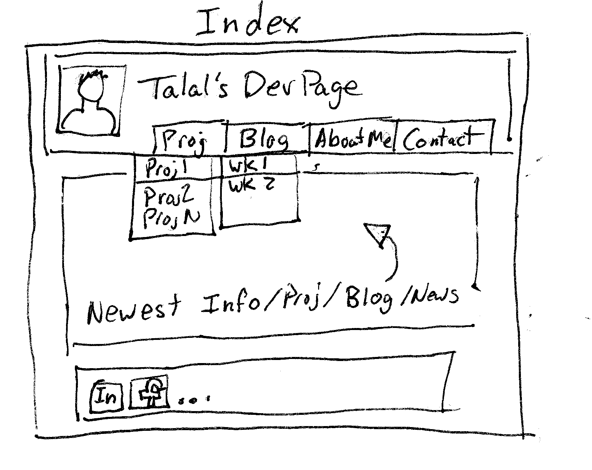

**Overall Reflections**
Wireframes are a handy tool to get a good idea of the layout of the page before you start scripting the page.  It shows all the necessary information that needs to go on the page and allows for a visual representation to get an idea of where things should go and allow you to add or remove elements.

*What is a wireframe?*

A wireframe is the visual layout of the page.  It should include all the critical information that needs to go on the page but not details such as specific text or images, etc.

*What are the benefits of wireframing?*

By laying it out first you can get an idea of the final page as it is easier to move elements around on paper than scripting something up and having to start over.

*Did you enjoy wireframing your site?*

It was a useful excersise to get the look I want.  Though there's always tweeks you want to make so at some point you just have to get it down.  I added drop downs on the menu which I know I can make with some forms but turning them into links may be tricky.

*Did you revise your wireframe or stick with your first idea?*

I kind of had the idea in my head on a basic layout and want to keep it simple and user friendly.  I may need to updated it again as I learn more to make it a bit more *flashy*.

*What questions did you ask during this challenge? What resources did you find to help you answer them?*

As I mentioned above I looked into the drop down to see what it takes to make.  Reading the recomended book on HTML and CSS I saw how the forms can make drop downs. It looks like it will take some type of java scripting based on clicking to make it work so I may need to wait on implementing it.

*Which parts of the challenge did you enjoy and which parts did you find tedious?*
I enjoyed laying it out, but as stated above you feel like it's never done.  Looking for a way to draw it up was a bit annoying.  I didn't want to open some trial accounts to do this one assignment so I drew it by hand, but perhaps if I find using them more often I may find it benificial as using the applicaitons makes it much cleaner. 
