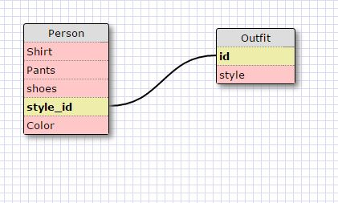

#What are databases for?#

They are ways to structure data that related into a 2d table. They are structered in columns
that define attributes and rows that describe an object

#What is a one-to-many relationship?#

One to many relationship is where there are many objects that can be lumped together together
such as in this excersise where we lumped states together in regions.

#What is a primary key? What is a foreign key? How can you determine which is which?#
Primary Key is a column of data that have no repeats.  It seperates the data such that each object is unique.
A foregin key is something that could be a primary key in another table.

#How can you select information out of a SQL database? What are some general guidelines for that?#
Information can be recovered by specifiying the information you are looking for in specific ways.  Below are
the methods used in this excersise to do sql searches.

#Calls in SQL excersise#

1)`SELECT * FROM states;`

2)`select * from regions;`

3)`select state_name, population from states;`

4)`select state_name, population from states order by population desc;`

5)`select state_name from states where region_id = 7;`

6)`select state_name, population_density from states where population_density>50 order by population_density asc;`

7)`select state_name from states where population between 1000000 and  1500000`

8)`select state_name, region_id from states order by region_id asc;`

9)`select region_name from regions where region_name like '%Central%';`

10)`select regions.region_name, states.state_name from regions inner join states on regions.id = states.region_id order by states.region_id;`

