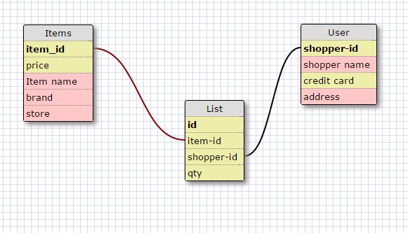
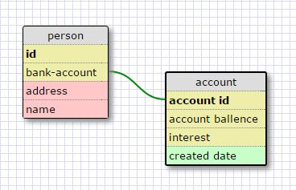

#What is a one-to-one database?#

A one to one database would be a where one can only exist with in the other but not necessaraly the other way around.

#When would you use a one-to-one database? (Think generally, not in terms of the example you created).#

If you want to keep data on a sub set of an item in your main object that describes it.

#What is a many-to-many database?#

Many to many is used to link two databases that are linked through a third.

#When would you use a many-to-many database? (Think generally, not in terms of the example you created).#

This would be used to connect two disperte databases which interact but do not really share information directly.

#What is confusing about database schemas? What makes sense?#

Schemas are confusing to think about but make more sense to me in practice than in concept.  I'm having a 
bit of a difficult time creating one in my head but if given list of data that need to be set up in tables 
I think I would be able to figure out the way it should be structured.

Schemas

